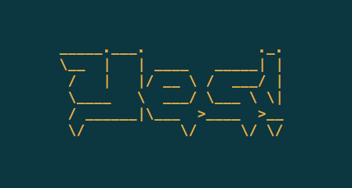

# Regular Expression Utility Command

[](https://godoc.org/github.com/rwxrob/regx)
[](LICENSE)
[](https://goreportcard.com/report/github.com/github.com/rwxrob/regx)

Simple utility command to create and test Go-compatible regular
expressions from the command line, `stdin`, or in a `regx.txt` file where
the first line is the expression and the rest of the file the test
content to be matched. When in `regx.txt` watch mode retest every 1/10th
of a second and center print a colorful `Sorry` or `Yes!` suitable for
displaying in a TMUX pane if there is a change. (You do use TMUX,
right?)

## Installation

If you have go installed you can use `go get`:

```
go get github.com/rwxrob/regx
```

## Usage

```
usage: regx REGX STRING
       ... | regx REGX
       regx (looks for regx.txt)
```

Sample successful `regx.txt`:

```
(?m)answ
answers = [
  "Yes.",
  "No.",
  "Maybe."
  ]
```



Sample failing `regx.txt`:

```
(?m)blah
answers = [
  "Yes.",
  "No.",
  "Maybe."
  ]
```


## Motivation

We use regular expressions all the time at SkilStak™ as we create text
bots and learning challenges that examine the content and output of
commands when validating student code. This tool is also used during our
regular expression lessons and workshops and a similar version is used
to assess student regular expression skills.

## TODO

Need to create a multi-line mode so every line after the first is
checked individually instead of all but the first lines being checked as
a buffer. This could be integrated into test cases specifically for
different natural language options.
